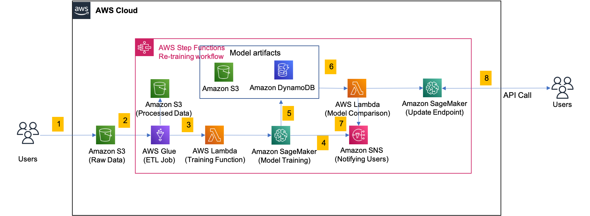
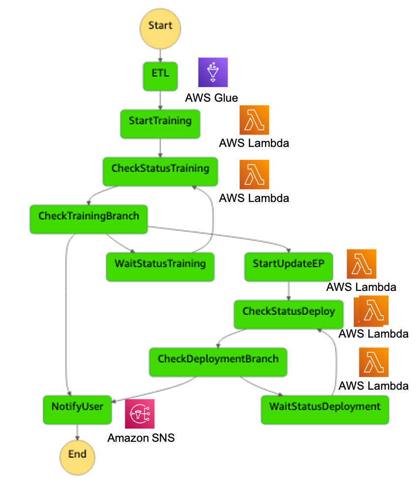

## Automating model retraining and deployment using the AWS Step Functions 

In this post, a retraining workflow for ML models is built. In this post, we will take you through a practical real-life example on how to create a serverless ML pipeline to develop and visualize different steps involved in data ingest, ETL, model re-training and deployment, and creating the model endpoints. We also show you how to trigger the workflow when new data become available. You can find the scripts for this solution in our _[GitHub repo](https://github.com/alitak-aws/ML-Solutions)_.
This post uses the following AWS services:

* AWS Step Functions (https://aws.amazon.com/step-functions/) allows you to coordinate several AWS  services into a serverless workflow. You can design and run workflows in  which the output of one step acts as the input to the next step, and embed  error handling into the workflow.
* Amazon SageMaker (https://aws.amazon.com/documentation/sagemaker/) is a fully managed service that provides  developers and data scientists with the tools to build, train, and deploy  different types of ML models.
* AWS  Glue (https://aws.amazon.com/glue) is a fully managed extract, transform, and load (ETL)  service. You can point AWS Glue to a supported data store and it generates  the code to extract and load it into your target data store. AWS Glue runs  on a distributed Apache Spark environment, which allows you to take  advantage of Spark without managing the infrastructure.
* AWS Lambda (http://aws.amazon.com/lambda) is a compute service that lets you run code  without provisioning or managing servers. Lambda executes your code only  when triggered and scales automatically, from a few requests per day to  thousands per second.

### Architecture, Steps, parameters, and dynamic workflows

The arhitecture for the solution is depicted here:

and steps are described as follows:
1. Users load the data into Amazon S3. 
1. Data are pulled from S3 with AWS GLUE. The transformed data are persisted in S3.
1. An ML training function is called in a AWS Lambda that starts a SageMaker training job. 
1. User gets notified with the status of the training job using Amazon SNS. 
1. At the end of a successful training job, the model artifacts are stored in S3 and DynamoDB. 
1. Lambda function compares the accuracy of the newly trained model with the existing deployed model. If the new model has higher accuracies, the hosting servers gets updated with the the new model. 
1. User gets notified with the status of the re-training job using Amazon SNS.
1. Users make API calls to make predictions. 

Within a Step Function, each step passes its output to the next. You can use these outputs in the following steps to create dynamic workflows. You can also pass input parameters for each Step Function execution. Parameters allow you to keep your workflow general so it can support other projects.

